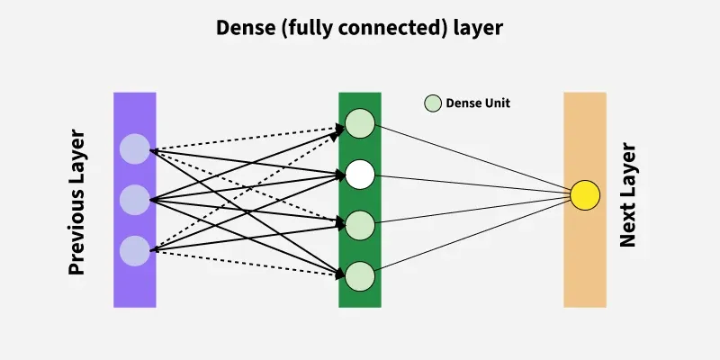

## 🏗️ Fully Connected Layer Architecture in Deep Learning

**Src : Greeksforgeeks**

### 📖 Definition
A **Fully Connected Layer (FC Layer)**, also called a **Dense Layer**, is a layer in which **every neuron is connected to every neuron in the next layer**.  
It is the fundamental building block of neural networks, especially used in **feedforward neural networks** and the **final stages of CNNs**.

---

### 🔑 Key Characteristics
- **Dense Connections**: Each neuron receives input from **all neurons** of the previous layer.  
- **Learnable Parameters**: Contains **weights** and **biases** that are updated during training.  
- **Activation Functions**: Non-linear functions (e.g., ReLU, Sigmoid, Softmax) applied to outputs.  

---

### ⚙️ How It Works
1. Each input is multiplied by a corresponding weight.  
2. A bias term is added.  
3. The result is passed through an **activation function**.  
4. This process is repeated for every neuron in the layer.  

Mathematically:  

\[
y = f(Wx + b)
\]

- \( x \) → input vector  
- \( W \) → weight matrix  
- \( b \) → bias  
- \( f \) → activation function  

---

### 📊 Example
- Input Layer: 3 neurons  
- Fully Connected Hidden Layer: 4 neurons  
- Output Layer: 2 neurons  

Every input neuron connects to all 4 hidden neurons, and each hidden neuron connects to both output neurons.

---

### 🎯 Use Cases
- **Classification**: Final layer in CNNs (e.g., ImageNet classifiers).  
- **Regression**: Predicting continuous values.  
- **Sequence Models**: Mapping extracted features to output predictions.  

---

✅ **In summary:** Fully Connected Layers act as the **decision-making part** of deep learning models, combining learned features and mapping them to output predictions.
